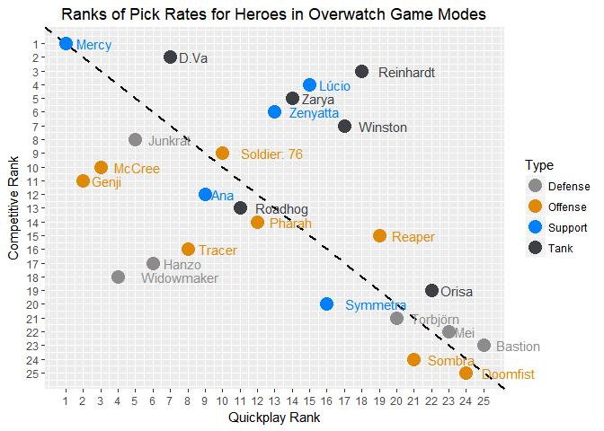
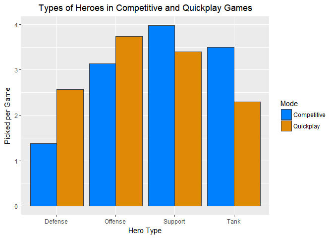
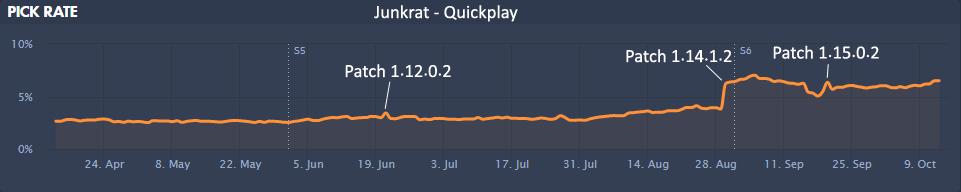
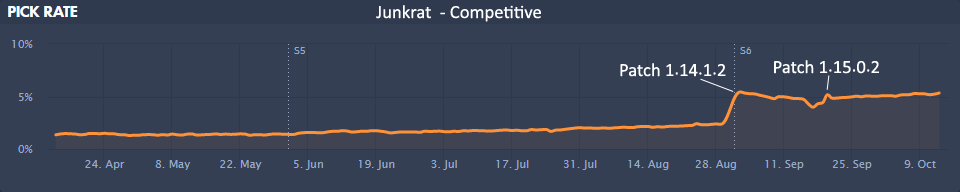

## Overwatch Hero Pick Rate Analysis in R

### Synopsis

The game [Overwatch](http://playoverwatch.com/en-us/) has become increasingly popular, recently reaching [over 30 million players](http://www.pcgamesn.com/overwatch/overwatch-sales-numbers). In this first-person shooter, you play with 5 teammates against another group of 6. Each player gets to choose one of currently 25 heroes to play in a single game. Apart from Arcade or Custom game modes, which won't be visited in this analysis, each team is only allowed one unique hero. So if you pick to play as Tracer, no one else on your team can pick Tracer. These heroes are divided into four types:

* **Offense**: Doomfist, Genji, McCree, Pharah, Reaper, Solder: 76, Sombra, and Tracer
* **Defense**: Bastion, Hanzo, Junkrat, Mei, Torbjörn, and Widowmaker
* **Tank**: D.Va, Orisa, Reinhardt, Roadhog, Winston, and Zarya
* **Support**: Ana, Lúcio, Mercy, Symmetra, and Zenyatta

The play modes I'll be looking at in this analysis are the Quickplay mode and the Competitive mode. In quickplay, any player can play as many number of matches as they want, leave after any match, and is more suited to casual play. In competitive play, players have to stay on the same team for a number of matches, are penalized if they continuously leave the game while the matches are still going on, and are given a ranking after 10 placement matches. Players fight to be in the top 500 for each competitive "season", which awards certain bonuses.

Since these play modes involve the same types of matches but competitive play has the additional "status" aspect in which players try to be the best, I was wondering how pick rates for certain heroes differ across these play modes. Are certain heroes preferred in quickplay but not competitive (and vice versa)? If so, why?

***

### Load in Hero Data from Overbuff.com

The first step was seeking out some pick rate data. Which heroes are chosen for quickplay matches and which are chosen for competitive matches? I looked at [Overbuff](http://www.overbuff.com), from the PC platform for the past month (September 12, 2017 to October 12, 2017).

The data that will be loaded in for this analysis was scraped from [Overbuff heroes page](http://www.overbuff.com/heroes). The details of this process can be found [here](http://github.com/idanileiko/OverwatchPCPickRateAnalysis/tree/master/Scraper), in the scraper part of this repo.


Load in all the packages that will be used in this analysis.


```r
library(rvest)
library(ggplot2)
library(grid)
```


```r
# Load in the data frame; change the timestamp date to match the file that is saved
timestamp <- "10-12-2017"
filename <- paste0("Heroes_", timestamp, ".Rda")
load(filename)

str(Heroes)
```

```
## 'data.frame':	50 obs. of  8 variables:
##  $ Name     : chr  "Ana" "Ana" "Bastion" "Bastion" ...
##  $ Type     : chr  "Support" "Support" "Defense" "Defense" ...
##  $ Tags     : chr  " Healer" " Healer" " High Damage, Stationary" " High Damage, Stationary" ...
##  $ Mode     : Factor w/ 2 levels "Competitive",..: 2 1 2 1 2 1 2 1 2 1 ...
##  $ ElimRatio: num  1.27 1.28 2.59 2.61 3.72 3.88 1.58 1.68 2.43 2.69 ...
##  $ OnFire   : chr  "7.4%" "11.9%" "14.6%" "20.4%" ...
##  $ PickRate : chr  "4.07%" "4.60%" "0.70%" "0.64%" ...
##  $ WinRate  : chr  "100.00%" "43.68%" "99.96%" "50.61%" ...
```

***

### Do quickplay and competitive modes have different pick rates of heroes?

In order to see if these two modes have different hero pick rates, I'm going to first make sure the pick rates are in a numeric format. Also, I'll manually input the difficulty ratings that the game itself gives to heroes to see if it shows a pattern later in the analysis.

first, load in all the packages that will be used in this analysis.


```r
library(rvest)
library(ggplot2)
library(grid)
library(reshape2)
```


```r
# Convert percentages of pick rate into numeric rates
Heroes$PickRate <- Heroes$PickRate %>%
  gsub("%", "", .) %>%
  as.numeric()

# Add in hero difficulty ratings (taken manually from the game)
Heroes$Difficulty <- as.factor(c(3, 3, 1, 1, 2, 2, 3, 3, 3, 3, 3, 3, 2, 2, 2, 2, 2, 2, 3, 3, 1, 1, 2, 2, 1, 1, 
                       1, 1, 1, 1, 1, 1, 1, 1, 3, 3, 2, 2, 2, 2, 2, 2, 2, 2, 2, 2, 3, 3, 3, 3))
```

Now since everything is in one data frame, I'm going to split it into quickplay mode and competitive mode. Then I'm going to make sure it's in decreasing order for pick rates.


```r
# Subset by play mode
HeroQuick <- subset(Heroes, Mode == "Quickplay")
HeroComp <- subset(Heroes, Mode == "Competitive")

# Order each play mode by pick rate
HeroQuick <- HeroQuick[order(HeroQuick$PickRate, decreasing = TRUE), ]
HeroComp <- HeroComp[order(HeroComp$PickRate, decreasing = TRUE), ]

head(HeroQuick)
```

```
##          Name    Type                Tags      Mode ElimRatio OnFire PickRate WinRate Difficulty
## 21      Mercy Support  Healer, Vulnerable Quickplay      0.40   6.1%    14.14 100.00%          1
## 9       Genji Offense             Flanker Quickplay      2.43  11.8%     8.71 100.01%          3
## 17     McCree Offense             Flanker Quickplay      2.13  11.8%     6.99  99.97%          2
## 43 Widowmaker Defense              Sniper Quickplay      2.35   8.9%     6.58 100.02%          2
## 13    Junkrat Defense         High Damage Quickplay      2.29  14.0%     6.02 100.02%          2
## 11      Hanzo Defense              Sniper Quickplay      2.21  12.9%     5.66  99.94%          3
## 
```

```r
head(HeroComp)
```

```
##         Name    Type                   Tags        Mode ElimRatio OnFire PickRate WinRate Difficulty
## 22     Mercy Support     Healer, Vulnerable Competitive      0.23   6.3%    15.91  52.27%          1
## 6       D.Va    Tank              Disruptor Competitive      3.88  11.1%     6.61  51.50%          2
## 30 Reinhardt    Tank          Point Control Competitive      1.87  11.2%     6.22  51.95%          1
## 16     Lúcio Support  Healer, Point Control Competitive      1.76  11.8%     5.74  50.21%          2
## 48     Zarya    Tank          Point Control Competitive      3.13  13.4%     5.56  49.57%          3
## 50  Zenyatta Support     Healer, Vulnerable Competitive      2.04  11.7%     5.27  52.46%          3
##
```

This data frame has a bit more information (`ElimRatio`, `OnFire`, etc.) than I need for the figure I'm going to make so I'll create a smaller data frame with just the hero name, type, and pick rate rankings in each of the play modes. Then I'll populate it with the ranks.


```r
# Create data frame that will be populated with rankings
HeroList <- (data.frame(Name = character(25), Type = factor(25), RankQuick = numeric(25), RankComp = numeric(25)))
HeroList$Name <- unique(Heroes$Name)
HeroList$Type <- as.factor(Heroes$Type[seq(1,50,2)])

# Find ranking order of hero pick rates
for (i in 1:length(HeroList$Name)){
 HeroList$RankQuick[i] <- which(HeroQuick$Name == HeroList$Name[i])
 HeroList$RankComp[i] <- which(HeroComp$Name == HeroList$Name[i])
}
head(HeroList)
```

```
##       Name    Type RankQuick RankComp
## 1      Ana Support         9       12
## 2  Bastion Defense        25       23
## 3     D.Va    Tank         7        2
## 4 Doomfist Offense        24       25
## 5    Genji Offense         2       11
## 6    Hanzo Defense         6       17
```

Now that I have the pick rate ranks for both play modes, I'm going to create a scatter plot to see if there's an agreement in the overall heroes chosen for the matches.


```r
# Scatterplot contrasting pick rates in competitive vs. quickplay modes
p <- ggplot(data = HeroList, aes(x = RankQuick, y = RankComp, color = Type)) +
  geom_abline(intercept = 0, slope = -1, linetype="dashed", size = 1) + geom_point(size = 5) +
  scale_y_continuous(trans = "reverse", breaks = seq(1,25,1)) + scale_x_continuous(breaks = seq(1,25,1)) +
  labs(title = "Ranks of Pick Rates for Heroes in Overwatch Game Modes", x = "Quickplay Rank", y = "Competitive Rank") +
  theme(plot.title = element_text(hjust = 0.5)) + geom_text(aes(label = Name), hjust = -0.30) +
  scale_color_manual(values=c("#8d8b8b", "#e08906", "#0180fe", "#3c4044"))

# Make sure all the label text is readable (allow it to go past the coordinate bounds)
gt <- ggplot_gtable(ggplot_build(p))
gt$layout$clip[gt$layout$name == "panel"] <- "off"
grid.draw(gt)
```

<!-- -->

This figure is interesting because it looks like there's a lot of variability between the heroes chosen for competitive play compared to the ones chosen for quickplay. The dashed line shows where the points would fall if the rankings were the same for each hero in the two different play modes. The farther away a hero is from this line, the more of a difference between the pick rate of them in the two play modes. The only hero that has the same pick rate ranking in both play modes is the top chosen hero, Mercy. Heroes that fall on the left side of the line are chosen more in quickplay than in competitive play. Heroes that fall on the right side of the line are chosen more in competitive play than in quickplay.

To be sure of the conclusion that the rankings are very different, let's quantify the relationship by calculating a correlation coefficient. Since this is ranked data, I'm going to use [Kendall's Tau](https://en.wikipedia.org/wiki/Kendall_rank_correlation_coefficient), which considers the numbers of concordant and discordant pairs of ranks in the data.


```r
ranks <- cbind(HeroList$RankQuick, HeroList$RankComp)
corr <- cor(ranks, method="kendall")
corr
```

```
##      [,1] [,2]
## [1,] 1.00 0.36
## [2,] 0.36 1.00
```

Indeed, a value of `0.36`, which is far from the perfect correlation of `1`, does not indicate a strong relationship between the rankings. So what's going on? There's a lot to dig through so I'll split this up into different sections.

#### Are different hero types chosen for different play modes? 

Overbuff has a separate page for hero types (roles) and their statistics [here](http://www.overbuff.com/roles). I'll read in that data to visualize the differences in popularity of hero types in the two play modes.


```r
# Read in popularity of hero types in quickplay
page <- read_html("http://www.overbuff.com/roles")
types <-  page%>%
  html_nodes("td") %>%
  html_text()
# Create the quickplay data frame
TypesQuick <- (data.frame(Role = character(4), Popularity = character(4), Picked = character(4), WinRate = character(4), 
                          OnFire = character(4), EDRatio = character(4)))
TypesQuick$Role <- c(types[2], types[25], types[48], types[71])
TypesQuick$Popularity <- c(types[3], types[26], types[49], types[72])
TypesQuick$Picked <- c(types[4], types[27], types[50], types[73]) %>%
  gsub(" /game", "", .)
TypesQuick$WinRate <- c(types[5], types[28], types[51], types[74])
TypesQuick$OnFire <- c(types[6], types[29], types[52], types[75])
TypesQuick$EDRatio <- c(types[7], types[30], types[53], types[76]) %>%
  gsub("\n\n", "", .)
TypesQuick$Mode <- replicate(4, "Quickplay")

# Read in popularity of hero types in competitive play
page <- read_html("http://www.overbuff.com/roles?mode=competitive")
types <-  page %>%
  html_nodes("td") %>%
  html_text()
# Create the competitive data frame
TypesComp <- (data.frame(Role = character(4), Popularity = character(4), Picked = character(4), WinRate = character(4), 
                         OnFire = character(4), EDRatio = character(4)))
TypesComp$Role <- c(types[2], types[25], types[48], types[71])
TypesComp$Popularity <- c(types[3], types[26], types[49], types[72])
TypesComp$Picked <- c(types[4], types[27], types[50], types[73]) %>%
  gsub(" /game", "", .)
TypesComp$WinRate <- c(types[5], types[28], types[51], types[74])
TypesComp$OnFire <- c(types[6], types[29], types[52], types[75])
TypesComp$EDRatio <- c(types[7], types[30], types[53], types[76]) %>%
  gsub("\n\n", "", .)
TypesComp$Mode <- replicate(4, "Competitive")

# Combine into one data frame
Types <- rbind(TypesQuick, TypesComp)
Types <- Types[order(Types$Role), ]

# Reformat for plotting
Types$Role <- as.factor(Types$Role)
Types$Mode <- as.factor(Types$Mode)
Types$Picked <- as.numeric(Types$Picked)

# Bar graph of the hero types in the two play modes
ggplot(data = Types, aes(x = Role, y = Picked, fill = Mode)) +
  geom_bar(stat = "identity", position = "dodge", color = "#3c4044") + 
  scale_fill_manual(values=c("#0180fe", "#e08906")) +
  labs(title = "Types of Heroes in Competitive and Quickplay Games", x = "Hero Type", y = "Picked per Game") +
  theme(plot.title = element_text(hjust = 0.5))
```

<!-- -->

##### **Defense**

Defense heroes tend to rank low in both quickplay and competitive play, with a slightly higher ranking in quickplay. The exception to this low ranking is Junkrat. Why is he ranked so high compared to the other Defense heroes?

Junkrat and Bastion are the only Defense heroes who are tagged on Overbuff as "High Damage". However, Junkrat is chosen fairly often but Bastion is chosen more rarely. Perhaps Bastion needing to remain stationary in sentry mode to deal that high damage is less appealing to players. He's also a very large target, compared to Junkrat. Let's look at Junkrat pick trends over the last 6 months. These were taken from the [Overbuff Junkrat trends page](http://www.overbuff.com/heroes/junkrat/trends).




A big reason for the popularity of Junkrat may be that the patch released on August 29, 2017 buffed Junkrat by allowing him to hold two mines, increasing his tire movement speed by 30%, and removing the time limit for tire wall-climbing. This led to an increased pick rate in both play modes. Before this patch, Junkrat's pick rate was as low as the other Defense heroes. In addition, the patch on September 19, 2017 released the map Junkertown, located in the Australian Outback. Who to better play on this map than Junkrat, who fits right into the aesthetic? These two recent patches are making him a popular hero choice right now. We'll see how this trend continues in the next few months.

##### **Offense**

Offense heroes are also chosen more in quickplay than in competitive play. More heroes are Offense heroes than any other type (there are 8 Offense heroes compared to 6 Defense, 5 Support, and 6 Tank heroes.) These 8 heroes span a pretty wide range of rankings. In quickplay, their range is 2 (Genji) to 24 (Doomfist). In competitive play, their range is 9 (Soldier: 76) to 25 (Doomfist). I'll look at specific outliers later in the analysis.

##### **Support**

Support heroes have a wide range but are ranked realtively high in both play modes, since all match teams benefit from having a healer. In both play modes. Mercy is the top choice. Let's look at her pick rate trends, taken from the [Overbuff Mercy trends page](http://www.overbuff.com/heroes/mercy/trends).


Apart from being one of the healing characters that don't necessarily need to aim well to heal other players (contrasted with Ana), the patch released on September 19, 2017 (about a month before this analysis) fixed problems with Mercy's Resurrect ability by moving it from her ultimate and replacing the ultimate with Valkyrie, which enhances her abilities for 20 seconds. This change was made to prevent Mercy players from staying away from the main fight and instead to encourage her to be around the other teammates during big battles. This change led to a spike in her pick rate in both play modes. A smaller spike can be seen in quickplay mode at the time the Summer Games patch came out, releasing a number of new Mercy skins and victory poses.

##### **Tank**

Tank heroes are chosen more often for competitive play than for quickplay, maybe because of their high health and ability to take damage from the opposing team. The top choice in both play modes is D.Va, so let's look at her trends, taken from [Overbuff D.Va trends page](http://www.overbuff.com/heroes/dva/trends)


D.Va pick rate trends have been relatively stable for the past 6 months, with few significant sudden spikes or drops, especially in competitive mode. The September 19, 2017 patch gave a new ability to D.Va, the Micro Missiles, as well as modified her Defense Matrix's resource meter to deplete quicker but regenerate energy faster. This seemed to affect quickplay much more than competitive play. Perhaps she's a popular choice for a Tank hero because of the "second chance" feeling when she loses her Mech but is still alive and can damage the opposing players. On the contrary, the least popular Tank hero, Orisa is not chosen often for quickplay or competitive play. 

***

### Why are some heroes primarily chosen for only one of the play modes?

Now that we looked at the hero types, I want to look at specific heroes that are outliers, or chosen very often for one play mode but very rarely for the other play mode. So I'm going to look at the heroes that are farthest away from the dotted line in the first scatterplot graph I made.

Let's calculate the biggest differences in the ranking.


```r
## Which heroes have the biggest difference?
HeroList$Diff <- HeroList$RankQuick - HeroList$RankComp
HeroList <- HeroList[order(HeroList$Diff, decreasing = TRUE), ]
HeroList
```

```
##           Name    Type RankQuick RankComp Diff
## 15   Reinhardt    Tank        18        3   15
## 8        Lúcio Support        15        4   11
## 23     Winston    Tank        17        7   10
## 24       Zarya    Tank        14        5    9
## 25    Zenyatta Support        13        6    7
## 3         D.Va    Tank         7        2    5
## 14      Reaper Offense        19       15    4
## 12       Orisa    Tank        22       19    3
## 2      Bastion Defense        25       23    2
## 10         Mei Defense        23       22    1
## 17 Soldier: 76 Offense        10        9    1
## 11       Mercy Support         1        1    0
## 4     Doomfist Offense        24       25   -1
## 20    Torbjörn Defense        20       21   -1
## 13      Pharah Offense        12       14   -2
## 16     Roadhog    Tank        11       13   -2
## 1          Ana Support         9       12   -3
## 7      Junkrat Defense         5        8   -3
## 18      Sombra Offense        21       24   -3
## 19    Symmetra Support        16       20   -4
## 9       McCree Offense         3       10   -7
## 21      Tracer Offense         8       16   -8
## 5        Genji Offense         2       11   -9
## 6        Hanzo Defense         6       17  -11
## 22  Widowmaker Defense         4       18  -14
```

This ordered data frame shows us which heroes are mostly chosen only for one of the two play modes and which ones have a relatively similar pick rate in both game types. As I noted above, one hero doesn't move ranks at all across game modes: Mercy. 

##### **Stable Heroes**

There are 11 heroes who only move 1-3 ranks (Orisa, Bastion, Mei, Soldier: 76, Doomfist, Torbjörn, Pharah, Roadhog, Ana, Junkrat, and Sombra). Out of these, Junkrat and Soldier: 76 have relatively higher pick rates. Ana, Roadhog, and Pharah have average pick rates. Orisa, Mei, Doomfist, Torbjörn, Bastion, and Sombra have relatively low pick rates.

##### **Heroes Popular only in Quickplay**

The top 5 heroes that are chosen often in quickplay but rarely in competitive mode are (in order) Widowmaker, Hanzo, Genji, Tracer, and McCree. These have a higher average difficulty level: 2, 3, 3, 2, and 2, respectively. They are also mostly Offense (with the exception of Widowmaker and Hanzo, who are defense), the two types preferred by quickplay.

The most extreme of these, Widowmaker, has fairly [stable trends](http://www.overbuff.com/heroes/widowmaker/trends) in both quickplay and competitive. Quickplay pick rates are generally a lot higher, but the competitive pick rates have a few spikes.

##### **Heroes Popular only in Competitive Play**

The top 5 heroes that are chosen rarely in quickplay but often in competitive mode are (in order) Reinhardt, Lúcio, Winston, Zarya, Zenyatta. They have variable difficulty levels (assigned by the game itself): 1, 2, 2, 3, and 3, respectively. They are all either supports or tanks, which are preferred by competitive game modes, as seen in the graph.

The most extreme of these, Reinhardt, also has fairly [stable trends](http://www.overbuff.com/heroes/reinhardt/trends), with competitive rates being a lot higher.

***

### Conclusions

So what conclusions can we draw from this data and why does it matter?

If the goal of the game is to have all the heroes balanced, we need to look at the pick rates and the pick rate trends and pinpoint which heroes are being chosen overwhelmingly and which ones are being left in the dust. Mercy dominates the Support hero choice, which makes players not want to choose other Support heroes like Ana or Symmetra. Since Mercy jumped up in the ranks fairly recently, we need to wait to see if the trend of her being at the top continues. If it does, and the other Support heroes stop being chosen, maybe something needs to be rebalanced to make the Support heroes more equally appealing.

Over both play modes, heroes like Doomfist, Bastion, Sombra, Mei, and Torbjorn have the lowest pick rates. This might mean that either their abilities don't counter other heroes' abilities well. Alternatively, most people might just find them less fun to play (I personally don't agree with this is this is the case since Bastion and Torbjorn are in my favorites). But of course, this being a game means that players must be having fun to continue playing it. Individual variation is very important, since we all have different Hero and hero type preferences, so it would be interesting to see player-specific data on pick rates between when that player plays quickplay vs. competitive play. If we can somehow quantify how "fun" a Hero is to play and if it does turn out that some Heroes are overwhelmingly rated as "low-fun", then those Heroes' abilities can be tweaked in a way that is more appealing to players.
